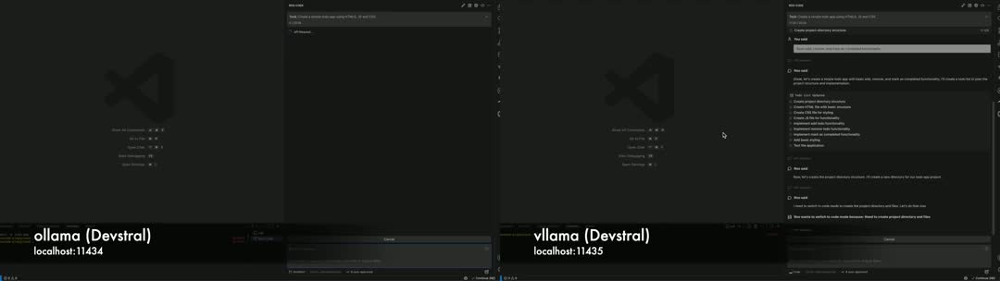

# vllama – Ultra-fast vLLM inference for ollama

vllama is a hybrid server that brings together the best of two worlds: it combines Ollama's versatile model management with the high-speed GPU inference of vLLM. The result is an OpenAI-compatible API that serves local models with optimized performance. It runs on port `11435` as a fast alternative to Ollama (which uses port `11434`), allowing you to run both simultaneously.

The server empowers you to use local large language models for programming tasks like **code generation**, **debugging**, and **code completion**. It is designed for efficient **local LLM** operations and on-device AI, serving as a powerful, private alternative to cloud-based services like GitHub Copilot.

<p align="center">
<a href="https://raw.githack.com/erkkimon/vllama/main/assets/player.html" target="_blank">

</a>
</p>

**Key Features:**
*   **On-Demand Model Loading & Unloading:** Models are loaded on-demand when a request is received and automatically unloaded after 5 minutes of inactivity, freeing up VRAM and making it a true on-demand solution.
*   **Automatic Context Length Optimization:** vllama automatically calculates and maximizes the context length based on your available VRAM, ensuring peak performance without manual tweaking.
*   **Broad Model Support:** All Ollama models are automatically discovered. While vLLM's GGUF support is experimental, many models, including top performers like **Devstral** and **DeepSeek**, are proven to work.
*   **Network-Wide Access:** Serve models to your entire local network, enabling **agents powered by local LLM** and collaborative development.
*   **Advanced Model Techniques:** Supports models using **quantization**, **distilled models for local programming**, and techniques like **model pruning** to run efficiently on your hardware.
*   **GPU-accelerated docker support:** You can easily run the vllama as service using Docker.

## Table of Contents

- [Quick Start (Docker Recommended)](#quick-start-docker-recommended)
- [Development](#development)
- [Supported Models](#supported-models)
- [Integrations with Programming Agents](#integrations-with-programming-agents)
- [Frequently Asked Questions (FAQ)](#frequently-asked-questions-faq)
- [Updates](#updates)
- [Logging](#logging)
- [Vision](#vision)
- [Client Integration Notes](#client-integration-notes)
- [How to contribute](#how-to-contribute)

## Quick Start (Docker Recommended)

Running `vllama` inside a Docker container is the recommended method as it provides a consistent and isolated environment.

### Prerequisites

1.  **Docker:** A working Docker installation.
2.  **NVIDIA Container Toolkit:** Required to run GPU-accelerated Docker containers. Please see the [official installation guide](https://docs.nvidia.com/datacenter/cloud-native/container-toolkit/latest/install-guide.html) for your distribution.

### Build and Run

1.  **Clone the repository:**
    First, clone this repository to your local machine and navigate into the directory.
    ```bash
    git clone https://github.com/erkkimon/vllama.git
    cd vllama
    ```

2.  **Build the Docker image:**
    From within the repository directory, run the build command:
    ```bash
    docker build -t vllama .
    ```

3.  **Run the container using the helper script:**
    The helper script will automatically detect your Ollama models path and launch the container as a background service.
    ```bash
    ./helpers/start_dockerized_vllama.sh
    ```
    `vllama` will then be available at `http://localhost:11435`.

Once running, you can manage the `vllama` service using standard Docker commands:

*   **View Logs:**
    To view logs in real-time:
    ```bash
    docker logs -f vllama-service
    ```
    To view the last 100 lines of logs:
    ```bash
    docker logs --tail 100 vllama-service
    ```
*   **Stop the Service:**
    ```bash
    docker stop vllama-service
    ```
*   **Start the Service (if you stopped it):**
    ```bash
    docker start vllama-service
    ```
*   **Remove the Service Permanently:**
    ```bash
    docker stop vllama-service
    docker rm vllama-service
    ```

## Development

If you want to run `vllama` directly from the source for development, follow these steps.

1.  **Clone the repository:**
    ```bash
    git clone https://github.com/erkkimon/vllama.git
    cd vllama
    ```

2.  **Create a Virtual Environment and Install Dependencies:**
    This requires Python 3.12 or newer.
    ```bash
    python3 -m venv venv312
    source venv312/bin/activate
    pip install -r requirements.txt
    ```

3.  **Run the application:**
    ```bash
    python vllama.py
    ```
    The server will start on `http://localhost:11435`.

## Supported Models

vllama can run any GGUF model available on Ollama, but compatibility ultimately depends on vLLM's support for the model architecture. The table below lists models that have been tested or are good candidates for local coding tasks.

| Model Family | Status | Notes |
|---|---|---|
| **Devstral** | ✅ **Proven to Work** | Excellent performance for coding and general tasks. |
| **DeepSeek-R1** | ✅ **Proven to Work** | Great for complex **programming** and following instructions. |
| **DeepSeek-V2 / V3** | ❔ Untested | Promising for **code generation** and **debugging**. |
| **Mistral / Mistral-Instruct** | ❔ Untested | Lightweight and fast, good for **code completion**. |
| **CodeLlama / CodeLlama-Instruct** | ❔ Untested | Specifically **fine-tuned** for programming tasks. |
| **Phi-3 (Mini, Small, Medium)** | ❔ Untested | Strong reasoning capabilities in a smaller package. |
| **Llama-3-Code** | ❔ Untested | A powerful contender for local coding performance. |
| **Qwen (2.5, 3, 3-VL, 3-Coder)** | ❔ Untested | Strong multilingual and coding abilities. |
| **Gemma / Gemma-2** | ❔ Untested | Google's open models, good for general purpose and coding. |
| **StarCoder / StarCoder2** | ❔ Untested | Trained on a massive corpus of code. |
| **WizardCoder** | ❔ Untested | Fine-tuned for coding proficiency. |
| **GLM / GLM-4** | ❔ Untested | Bilingual models with strong performance. |
| **Codestral** | ❔ Untested | Mistral's first code-specific model. |
| **Kimi K2** | ❔ Untested | Known for its large context window capabilities. |
| **Granite-Code** | ❔ Untested | IBM's open-source code models. |
| **CodeBERT** | ❔ Untested | An early but influential code model. |
| **Pythia-Coder** | ❔ Untested | A model for studying LLM development. |
| **Stable-Code** | ❔ Untested | From the creators of Stable Diffusion. |
| **Mistral-Nemo** | ❔ Untested | A powerful new model from Mistral. |
| **Llama-3.1** | ❔ Untested | The latest iteration of the Llama family. |
| **TabNine-Local** | ❔ Untested | Open variants of the popular code completion tool. |

## Integrations with Programming Agents

One of the most powerful uses of vllama is to serve as the brain for local programming agents. This is **how to use local llm for software development** in a modern, automated way.

### Roo Code, Cline, and Goose Setup

**Roo Code**, **Cline**, **Kilo Code** and **Goose** are powerful programming agents that can use vllama for **inference**. Since vllama provides an OpenAI-compatible API, setting them up is straightforward.

1.  **Start vllama**: Ensure your `vllama.service` is running or start it manually.
2.  **Configure the Agent**: In your agent's settings (e.g., in Roo Code's `config.toml`), point the API endpoint to vllama's address.
    *   **API URL**: `http://localhost:11435/v1`
    *   **Model Name**: Select one of the models you have pulled with Ollama (e.g., `huihui_ai/devstral-abliterated:latest`).
    *   **API Key**: You can typically leave this blank.

Now, your agent will use your local GPU for lightning-fast, private **code generation** and **debugging**.

### Other Agent Integrations

The same principle applies to most modern AI agents. vllama can serve as a local, private backend for many popular tools, making it a fantastic alternative to cloud-based services.

*   **AI Agent Frameworks**: For frameworks like **LangChain agents**, **AutoGen**, and **CrewAI**, you can configure the LLM client to point to the vllama endpoint (`http://localhost:11435/v1`). This allows you to build complex workflows that run entirely on your hardware.
*   **Interpreter-Style Agents**: Tools like **Open-Interpreter** and open-source alternatives to **Devin-AI** can be configured to use a local OpenAI-compatible endpoint, making them perfect companions for vllama.
*   **IDE Plugins & Tools**: Plugins and tools like **Aider**, **Cursor-AI local**, **Tabby-ML**, **Continue-dev**, and alternatives for **CodeWhisperer local** often support custom local endpoints. Point them to vllama to get superior performance and privacy compared to their default cloud services.
*   **Other Coding Assistants**: The OpenAI-compatible API allows vllama to be a backend for many other tools, including experimental or less common ones like **Claude Code** and **Kilo Code**.
*   **Advanced Agent Architectures**: If you are experimenting with **Reflexion agents**, **ReAct agents for coding**, or **Tree-of-Thoughts coding**, vllama provides the fast, local **inference** engine you need to power your research.

## Frequently Asked Questions (FAQ)

**Q: Why is my model's context window smaller than expected?**

**A:** vllama prioritizes speed and stability by running inference exclusively on your GPU. To prevent out-of-memory errors, it automatically calculates the maximum possible context window based on the VRAM available *after* the model is loaded. If you need a larger context window, you should try a smaller model or a version with more aggressive **quantization** (e.g., a 4-bit or 5-bit quantized model instead of a 7-bit or 8-bit one). Finding the **best quantized llm for programming tasks** often involves balancing performance with context size.

**Q: Which local LLM is best for programming?**

**A:** The "best" model depends heavily on your hardware, the specific task (e.g., **code completion** vs. complex **debugging**), and personal preference. The goal of vllama is to make it easy to experiment. Check the [Supported Models](#supported-models) table to explore options.

**Q: How can I use a local LLM for software development?**

**A:** Using a **local large language model for programming** offers several advantages:
1.  **Privacy**: Your code never leaves your machine.
2.  **Speed**: **Inference** is performed directly on your GPU, eliminating network latency.
3.  **Offline Access**: Continue working without an internet connection, making it a true **offline AI** solution.
4.  **Customization**: You can choose from dozens of open-source models, including **fine-tuned** or **distilled models for local programming**, to find the perfect fit for your needs.
vllama is the engine that makes this practical and efficient.

**Q: Is this a free local LLM for developers?**

**A:** Yes. vllama is an open-source tool that is completely free to use. You provide the hardware, and vllama provides the high-performance inference server. It's part of a growing ecosystem of free, open-source tools designed to democratize access to powerful AI.

## Updates

*   **Nov 15, 2025:** Added Docker support for a consistent, portable environment and a new helper script to make running it easier.
*   **Nov 4, 2025:** Support for the `deepseek-r1` architecture has been added! 🧠 This allows models like `huihui_ai/deepseek-r1-abliterated:14b` to be used with `vllama`.
*   **Nov 3, 2025:** `vllama` is alive! 🎉 Devstral models are confirmed to work flawlessly, bringing high-speed local inference to the community. 🚀

## Logging

`vllama` logs important events and errors to help with debugging and monitoring.

*   **Service (Production):** When running as a systemd service, logs are located in `/opt/vllama/logs/`.
*   **Development:** When running `vllama.py` directly from the repository, logs are located in a `logs/` directory within the project root.

To monitor the logs in real-time, you can use the `tail -f` command on the appropriate log file.

## Vision

The vision for vllama is to make high-performance AI inference accessible and efficient. By integrating vLLM's advanced GPU optimizations, it addresses common pain points like slow Ollama inference while maintaining Ollama's simple workflow. This makes it an ideal solution for **local programming** and **local models powered software development**, enabling **agents powered by local LLM** to run efficiently. Whether you're looking for an OpenAI-compatible vLLM server or a way to unload vLLM models when idle, vllama aims to be the go-to tool for users wanting faster **inference** with **Ollama** and **vLLM**.

## How to contribute

All pull requests are welcome! Also, if you have succesfully run your favorite LLM in GGUF format with vLLM, please share it by creating and issue. It will help a lot integrating it into vllama!

## Client Integration Notes

If you are using clients like **Roo Code** or **Cline**, it is recommended to adjust the maximum context window length in the client's settings to match your available VRAM. Condensing at 80% of the context window size is recommended for optimal performance.